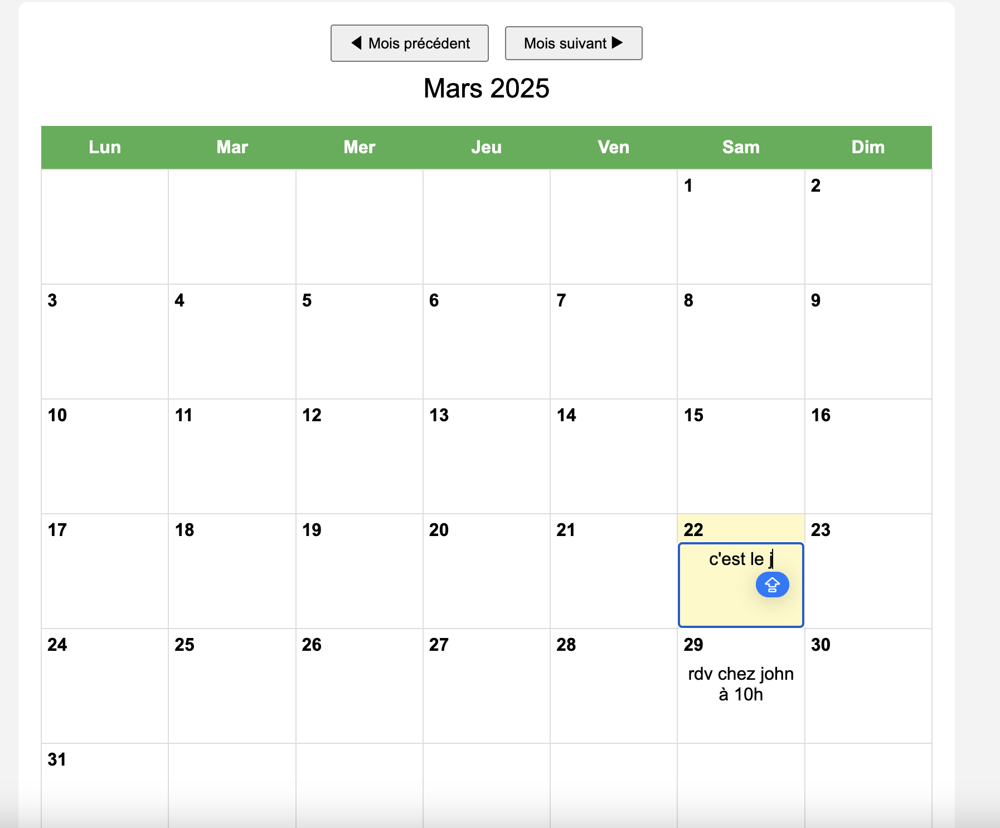

# Agenda Mensuel Modifiable

Un **calendrier mensuel** en **HTML/CSS/JS** où **chaque case est éditable**.  
Les notes ajoutées sont enregistrées localement, sans base de données, grâce à **localStorage**.

## Fonctionnalités
- Navigation entre les mois (boutons “Mois Précédent” / “Mois Suivant”).
- Chaque jour du mois est cliquable et éditable directement (“contentEditable”).
- Sauvegarde automatique dans le **localStorage** à chaque modification.
- Mise en évidence du **jour actuel** (fond coloré).

## Installation & Lancement
1. **Cloner** ce dépôt ou télécharger les fichiers.
2. **Ouvrir** `index.html` dans un navigateur.  
   - Pour éviter les restrictions sur `localStorage`, utilisez un serveur local (ex. Live Server sur VSCode).
3. **Ajouter** du contenu directement dans les cases, il sera mémorisé.

## Compétences acquises
- **Manipulation du DOM** avec `contentEditable` pour éditer directement le contenu.
- **localStorage** : persistance des données côté client.
- **Gestion de dates** : calcul du 1er jour du mois, nombre de jours par mois, changement de mois.
- **Conception d’interface** : table HTML pour un calendrier mensuel propre.

## Améliorations possibles
- Bouton “Réinitialiser” pour effacer toutes les données.
- Gestion des heures / évènements plus avancés.
- Sélecteur d’année (au lieu de naviguer seulement mois par mois).

